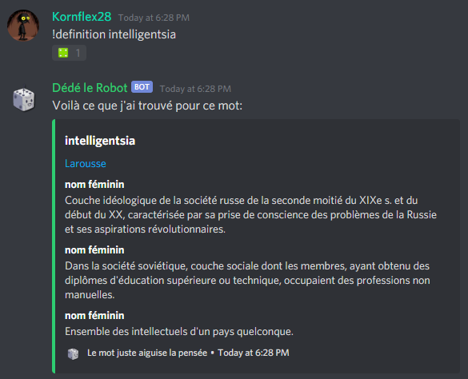

# discord-bot : Dédé le Robot 

 

Dédé le Robot is a french multifunction bot for Discord made for fun using Node.js.

>Dédé has curently **41** commands available and a server XP ranking system. 
>Dédé has excuted **1796** commands for now.
>
> *This was last dynamically generated on Thursday, February 11, 1:12 PM GMT+1.*

## Command examples
### !poem 
Give a random french poem.

 

### !wiki
Perform a wikipedia search

 

### !definition
Give the definition of a french word

